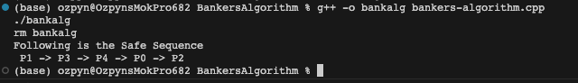

## Banker's Algorithm Assignment

Run the program:
```

```

### What is Banker's Algorithm?
The banker’s algorithm is a resource allocation and deadlock avoidance algorithm that tests for safety by simulating the allocation for the predetermined maximum possible amounts of all resources, then makes an “s-state” check to test for possible activities, before deciding whether allocation should be allowed to continue.

### Libraries Being Used:


### Implementation
Read in tables from text documents, one for each table.

### Example Output
