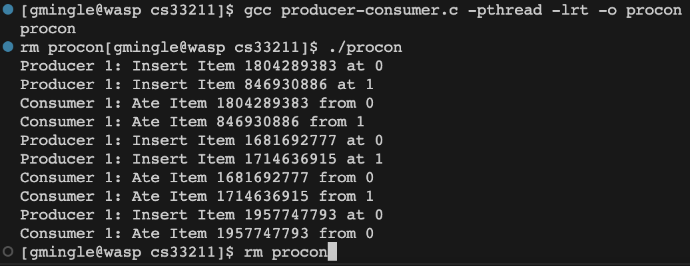

## Producer Consumer Assignment

Run the program:
```
gcc producer-consumer.c -pthread -lrt -o procon
./procon
rm procon
```

There are defined variables the user can modify:
- MaxItems
    - Determines the max number of items to be made / destroyed
- Table Size
    - Determines the size of the table. (How large the buffer is)
- NumProducer
    - How many producer characters there will be.
- NumConsumer
    - How many consumer characters there will be.

### Libraries Being Used:
- <pthread.h>
    - Utilize CPU Threads
- <semaphore.h>
    - Utilize Semaphores
- <stdlib.h>
    - Standard Library
- <stdio.h>
    - Standard Input Output

### Implementation

4 Variables can be assigned to limit the run-time of the program.

Usage of semaphores and a mutex lock ensure mutual exclusivity as it portains to shared resource access.

Consumer logic is inversely proportional to that of the Producer.

Threads and Semaphores are cleared at the end to clear up memory.

### Example Output
